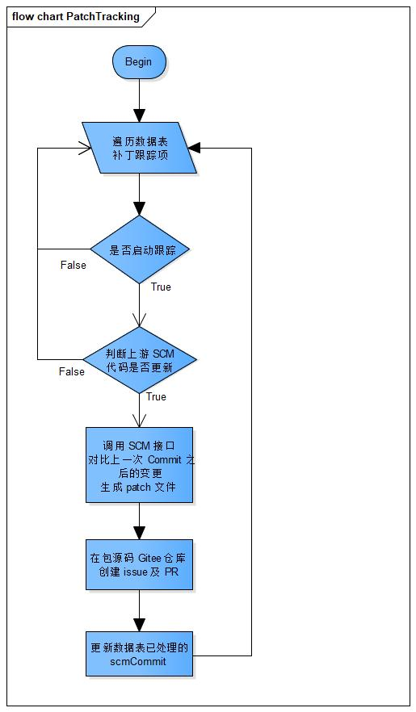

# patch-tracking

## Overview

During the development of the openEuler release, the latest code of each software package in the upstream community needs to be updated in a timely manner to fix function bugs and security issues, preventing the openEuler release from defects and vulnerabilities.

This tool manages the patches for software packages, proactively monitors the patches submitted by the upstream community, automatically generates patches, submits issues to the corresponding Maintainer, and verifies basic patch functions to reduce the verification workload and help the Maintainer make decisions quickly.

## Architecture

### C/S Architecture

patch-tracking uses the C/S architecture.

patch-tracking is located in the server. It executes patch tracking tasks, including maintaining tracking items, identifying branch code changes in the upstream repository and generating patch files, and submitting issues and PRs to Gitee. In addition, patch-tracking provides RESTful APIs for adding, deleting, modifying, and querying tracking items.

patch-tracking-cli is a command line tool located in the client. It invokes the RESTful APIs of patch-tracking to add, delete, modify, and query tracking items.

### Core Procedure

a. Patch tracking service procedure

The procedure for handling the submitted patch is as follows:

1. Add the tracking item using the command line tool.
2. Automatically obtain patch files from the upstream repository (for example, GitHub) that is configured for the tracking item.
3. Create a temporary branch and submit the obtained patch file to the temporary branch.
4. Automatically submit an issue to the corresponding repository and generate the PR associated with the issue.



b. Procedure for the Maintainer to handle the submitted patch

The procedure for handling the submitted patch is as follows:

1. The Maintainer analyzes the PR.
2. Execute the continuous integration (CI). After the CI is successfully executed, determine whether to merge the PR.


### Data structure

- Tracking table

| No. | Name            | Description                                                             | Type    | Key     | Is Null Allowed |
| --- | --------------- | ----------------------------------------------------------------------- | ------- | ------- | --------------- |
| 1   | id              | Sequence number of the tracking item of the self-added patch            | int     | -       | No              |
| 2   | version_control | Version control system type of the upstream SCM                         | String  | -       | No              |
| 3   | scm_repo        | Upstream SCM repository address                                         | String  | -       | No              |
| 4   | scm_branch      | Upstream SCM tracking branch                                            | String  | -       | No              |
| 5   | scm_commit      | Latest Commit ID processed by the upstream code                         | String  | -       | Yes             |
| 6   | repo            | Address of the Gitee repository where the package source code is stored | String  | Primary | No              |
| 7   | branch          | Branch of the Gitee repository where the package source code is stored  | String  | Primary | No              |
| 8   | enabled         | Indicating whether to start tracking                                    | Boolean | -       | No              |

- Issue table

| No. | Name   | Description                                                             | Type   | Key     | Is Null Allowed |
| --- | ------ | ----------------------------------------------------------------------- | ------ | ------- | --------------- |
| 1   | issue  | Issue No.                                                               | String | Primary | No              |
| 2   | repo   | Address of the Gitee repository where the package source code is stored | String | -       | No              |
| 3   | branch | Branch of the Gitee repository where the package source code is stored  | String | -       | No              |

## Tool Deployment

### Downloading Software

The repo source is officially released at <https://repo.openeuler.org/>.

The RPM package can be obtained from <https://repo.openeuler.org/>. Choose the correct version, **everything**, correct architecture, **Packages**, then select the RPM package to download.

### Installing the Tool

Method 1: Install patch-tracking from the repo source.

1. Use DNF to mount the repo source (The repo source of 21.03 or later is required. For details, see the [Application Development Guide](https://openeuler.org/zh/docs/21.03/docs/ApplicationDev/%E5%BC%80%E5%8F%91%E7%8E%AF%E5%A2%83%E5%87%86%E5%A4%87.html)). Run the following command to download and install patch-tracking and its dependencies.

2. Run the following command to install `patch-tracking`:

    ```shell
    dnf install patch-tracking
    ```

Method 2: Install patch-tracking using the RPM package.

1. Install the required dependencies.

    ```shell
    dnf install python3-uWSGI python3-flask python3-Flask-SQLAlchemy python3-Flask-APScheduler python3-Flask-HTTPAuth python3-requests python3-pandas
    ```

2. `patch-tracking-1.0.0-1.oe1.noarch.rpm` is used as an example. Run the following command to install patch-tracking.

    ```shell
    rpm -ivh patch-tracking-1.0.0-1.oe1.noarch.rpm
    ```

### Generating a Certificate

Run the following command to generate a certificate:

```shell
openssl req -x509 -days 3650 -subj "/CN=self-signed" \
-nodes -newkey rsa:4096 -keyout self-signed.key -out self-signed.crt
```

Copy the generated `self-signed.key` and `self-signed.crt` files to the **/etc/patch-tracking** directory.

### Configuring Parameters

Configure the corresponding parameters in the configuration file. The path of the configuration file is `/etc/patch-tracking/settings.conf`.

1. Configure the service listening address.

    ```text
    LISTEN = "127.0.0.1:5001"
    ```

2. GitHub Token is used to access the repository information hosted in the upstream open source software repository of GitHub. For details about how to create a GitHub token, see [Creating a personal access token](https://docs.github.com/en/github/authenticating-to-github/creating-a-personal-access-token).

    ```text
    GITHUB_ACCESS_TOKEN = ""
    ```

3. For a repository that is hosted on Gitee and needs to be tracked, configure a Gitee Token with the repository permission to submit patch files, issues, and PRs.

    ```text
    GITEE_ACCESS_TOKEN = ""
    ```

4. Scan the database as scheduled to detect whether new or modified tracking items exist and obtain upstream patches for the detected tracking items. Set the interval of scanning and the unit is second.

    ```text
    SCAN_DB_INTERVAL = 3600
    ```

5. When the command line tool is running, you need to enter the user name and password hash value for the authentication for the POST interface.

    ```text
    USER = "admin"
    PASSWORD = ""
    ```

    > The default value of `USER` is `admin`.

    Run the following command to obtain the password hash value. **Test@123** is the configured password.

    ```shell
    generate_password Test@123
    ```

    > The password hash value must meet the following complexity requirements:
    >
    > - The length is more than or equal to 6 bytes.
    > - The password must contain uppercase letters, lowercase letters, digits, and special characters (**~!@#%\^\*-\_=+**).

    Add the password hash value to the quotation marks of `PASSWORD = ""`.

### Starting the Patch Tracking Service

You can use either of the following methods to start the service:

- Using systemd.

    ```shell
    systemctl start patch-tracking
    ```

- Running the executable program.

    ```shell
    /usr/bin/patch-tracking
    ```

## Tool Usage

### Adding a Tracking Item

You can associate the software repository and branch to be tracked with the corresponding upstream open source software repository and branch in any of the following ways:

- Using CLI

    Parameter description:

    > `--user`: User name to be authenticated for the POST interface. It is the same as the USER parameter in the **settings.conf** file. \
    > `--password`: Password to be authenticated for the POST interface. It is the password string corresponding to the PASSWORD hash value in the **settings.conf** file. \
    > `--server`: URL for starting the patch tracking service, for example, 127.0.0.1:5001. \
    > `--version_control`: Control tool of the upstream repository version. Only GitHub is supported. \
    > `--repo`: Name of the repository to be tracked, in the format of organization/repository. \
    > `--branch`: Branch name of the repository to be tracked. \
    > `--scm_repo`: Name of the upstream repository to be tracked, in the GitHub format of organization/repository. \
    > `--scm_branch`: Branch of the upstream repository to be tracked. \
    > `--scm_commit`: Commit from which the tracking starts. By default, the tracking starts from the latest commit. \
    > `--enabled`: Indicates whether to automatically track the repository. 

    For example:

    ```shell
    patch-tracking-cli add --server 127.0.0.1:5001 --user admin --password Test@123 --version_control github --repo testPatchTrack/testPatch1 --branch master --scm_repo BJMX/testPatch01 --scm_branch test  --enabled true
    ```

- Using a Specified File

    Parameter description:

    > `--server`: URL for starting the patch tracking service, for example, 127.0.0.1:5001. \
    > `--user`: User name to be authenticated for the POST interface. It is the same as the USER parameter in the **settings.conf** file. \
    > `--password`: Password to be authenticated for the POST interface. It is the password string corresponding to the PASSWORD hash value in the **settings.conf** file. \
    > `--file`: YAML file path.

    Add the information about the repository, branch, version management tool, and whether to enable monitoring to the YAML file (for example, **tracking.yaml**). The file path is used as the command of the `--file` to invoke the input parameters.

    For example:

    ```shell
    patch-tracking-cli add --server 127.0.0.1:5001 --user admin --password Test@123 --file tracking.yaml
    ```

    The format of the YAML file is as follows. The content on the left of the colon (\:) cannot be modified, and the content on the right of the colon (\:) needs to be set based on the site requirements.

    ```shell
    version_control: github
    scm_repo: xxx/xxx
    scm_branch: master
    repo: xxx/xxx
    branch: master
    enabled: true
    ```

    > version\_control: Control tool of the upstream repository version. Only GitHub is supported. \
    > scm\_repo: Name of the upstream repository to be tracked, in the GitHub format of organization/repository. \
    > scm\_branch: Branch of the upstream repository to be tracked. \
    > repo: Name of the repository to be tracked, in the format of organization/repository. \
    > branch: Branch name of the repository to be tracked. \
    > enabled: Indicates whether to automatically track the repository.

- Using a Specified Directory

    Place multiple `xxx.yaml` files in a specified directory, such as the `test_yaml`, and run the following command to record the tracking items of all YAML files in the specified directory.

    Parameter description:

    > `--user`: User name to be authenticated for the POST interface. It is the same as the USER parameter in the **settings.conf** file. \
    > `--password`: Password to be authenticated for the POST interface. It is the password string corresponding to the PASSWORD hash value in the **settings.conf** file. \
    > `--server`: URL for starting the patch tracking service, for example, 127.0.0.1:5001. \
    > `--dir`: Path where the YAML file is stored.

    ```shell
    patch-tracking-cli add --server 127.0.0.1:5001 --user admin --password Test@123 --dir /home/Work/test_yaml/
    ```

### Querying a Tracking Item

Parameter description:

> `--server`: (Mandatory) URL for starting the patch tracking service, for example, 127.0.0.1:5001. \
> `--table`: (Mandatory) Table to be queried. \
> `--repo`: (Optional) repo to be queried. Query all content in the table if this parameter is not configured. \
> `--branch`: (Optional) Branch to be queried.

```shell
patch-tracking-cli query --server <SERVER> --table tracking
```

The website can be accessed properly.

```shell
patch-tracking-cli query --server 127.0.0.1:5001 --table tracking
```

### Querying the Generated Issue

```shell
patch-tracking-cli query --server <SERVER> --table issue
```

For example:

```shell
patch-tracking-cli query --server 127.0.0.1:5001 --table issue
```

### Deleting a Tracking Item

```shell
patch-tracking-cli delete --server SERVER --user USER --password PWD --repo REPO [--branch BRANCH]
```

For example:

```shell
patch-tracking-cli delete --server 127.0.0.1:5001 --user admin --password Test@123 --repo testPatchTrack/testPatch1 --branch master
```

> You can delete a single piece of data from a specified repo or branch. You can also delete data of all branches in a specified repo.

### Checking Issues and PRs on Gitee

Log in to Gitee and check the software project to be tracked. On the Issues and Pull Requests tab pages of the project, you can see the item named in `[patch tracking] TIME`, for example, the `[patch tracking] 20200713101548`. This item is the issue and PR of the patch file that is just generated.
