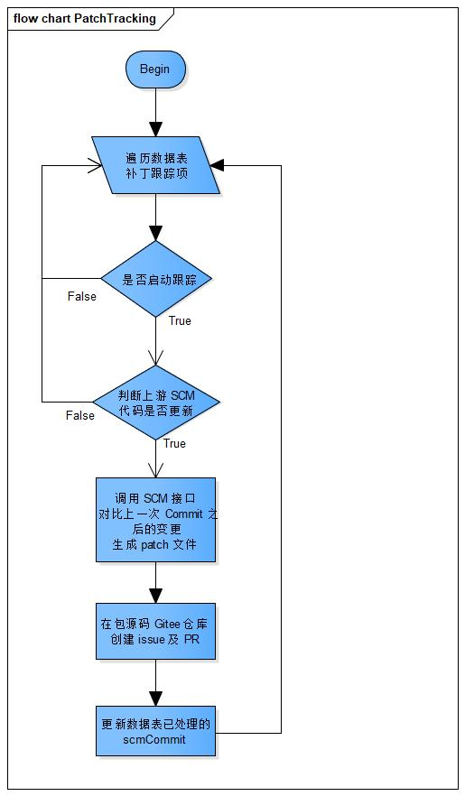
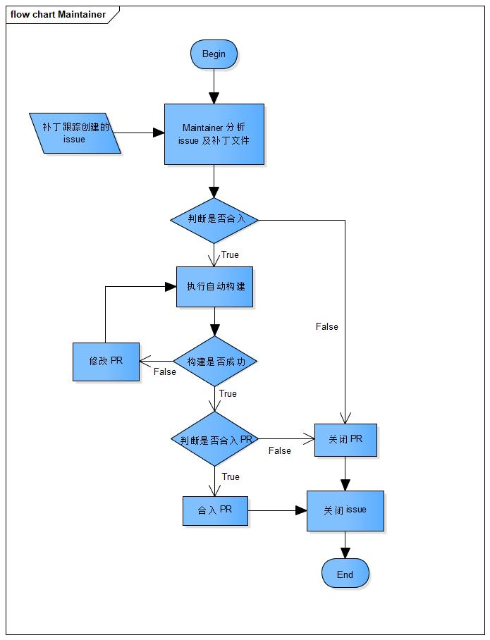

# patch-tracking

## 简介

在 openEuler 发行版开发过程中，需要及时更新上游社区各个软件包的最新代码，修改功能 bug 及安全问题，确保发布的 openEuler 发行版尽可能避免缺陷和漏洞。

本工具主要功能是对软件包进行补丁管理，主动监控上游社区提交，自动生成补丁，并自动提交 issue 给对应的 maintainer，同时自动验证补丁基础功能，减少验证工作量支持 maintainer 快速决策。

## 架构

### C/S架构

patch-tracking采用 C/S 架构。

服务端（patch-tracking）：负责执行补丁跟踪任务，包括：维护跟踪项、识别上游仓库分支代码变更并形成补丁文件、向 Gitee 提交 issue 及 PR。同时 patch-tracking 提供 RESTful 接口，用于对跟踪项进行增删改查操作。

客户端：即命令行工具（patch-tracking-cli），通过调用 patch-tracking 的 RESTful 接口，实现对跟踪项的增删改查操作。

### 核心流程

a. 补丁跟踪服务流程

主要步骤：

1. 通过命令行工具添加跟踪项。
2. 自动从跟踪项配置的上游仓库（例如GitHub）获取补丁文件。
3. 创建临时分支，将获取到的补丁文件提交到临时分支。
4. 自动提交 issue 到对应仓库，并生成关联 issue 的 PR。



b. Maintainer对提交的补丁处理流程

主要步骤：

1. Maintainer 分析 PR。
2. 执行 CI，执行成功后判断是否合入 PR。



### 数据结构

* Tracking表

| 序号 | 名称 | 说明 | 类型 | 键 | 允许空 |
|:----:| ----| ----| ----| ----| ----|
| 1 | id | 自增补丁跟踪项序号 | int | - | NO |
| 2 | version_control | 上游SCM的版本控制系统类型 | String | - | NO |
| 3 | scm_repo | 上游SCM仓库地址 | String | - | NO |
| 4 | scm_branch | 上游SCM跟踪分支 | String | - | NO |
| 5 | scm_commit | 上游代码最新处理过的Commit ID | String | - | YES |
| 6 | repo | 包源码在Gitee的仓库地址 | String | Primary | NO |
| 7 | branch | 包源码在Gitee的仓库分支 | String | Primary | NO |
| 8 | enabled | 是否启动跟踪 | Boolean | -| NO |

* Issue表

| 序号 | 名称 | 说明 | 类型 | 键 | 允许空 |
|:----:| ----| ----| ----| ----| ----|
| 1 | issue | issue编号 | String | Primary | NO |
| 2 | repo | 包源码在Gitee的仓库地址 | String | - | NO |
| 3 | branch | 包源码在Gitee的仓库分支 | String | - | NO |

## 工具部署

### 软件下载

Repo 源地址：[https://repo.openeuler.org/](https://repo.openeuler.org)。

rpm 包获取地址：[https://repo.openeuler.org/](https://repo.openeuler.org)，依次选择正确的版本号、everything、正确的架构、Packages，找到需要的rpm包，点击即可下载。

### 安装工具

方法1：从repo源安装

1. 使用 dnf 挂载 repo源（具体方法参考[《应用开发指南》](https://docs.openeuler.openatom.cn/zh/docs/25.09/server/development/application_dev/preparations-for-development-environment.html)）。
2. 执行以下命令安装`patch-tracking`及其依赖。

    ```shell
    # dnf install patch-tracking
    ```

方法2：直接使用rpm安装

1. 首先安装相关依赖。

    ```shell
    # dnf install python3-uWSGI python3-flask python3-Flask-SQLAlchemy python3-Flask-APScheduler python3-Flask-HTTPAuth python3-requests python3-pandas
    ```

2. 安装patch-tracking包。

    ```shell
    # rpm -ivh patch-tracking-xxx.rpm
    ```

### 生成证书

执行如下命令生成证书。

```shell
# openssl req -x509 -days 3650 -subj "/CN=self-signed" -nodes -newkey rsa:4096 -keyout self-signed.key -out self-signed.crt
```

将生成的 `self-signed.key` 和 `self-signed.crt` 文件拷贝到 /etc/patch-tracking 目录。

### 配置参数

在配置文件中对相应参数进行配置，配置文件路径为 `/etc/patch-tracking/settings.conf`。

1. 配置服务监听地址。

    ```text
    LISTEN = "127.0.0.1:5001"
    ```

2. GitHub Token，用于访问托管在 GitHub 上游开源软件仓的仓库信息，生成 GitHub Token 的方法参考 [Creating a personal access token](https://docs.github.com/en/github/authenticating-to-github/creating-a-personal-access-token)。

    ```text
    GITHUB_ACCESS_TOKEN = ""
    ```

3. 对于托管在gitee上的需要跟踪的仓库，配置一个有该仓库权限的gitee的token，用于提交patch文件，提交issue，提交PR等操作。

    ```text
    GITEE_ACCESS_TOKEN = ""
    ```

4. 定时扫描数据库中是否有新增或修改的跟踪项，对扫描到的跟踪项执行获取上游补丁任务，在这里配置扫描的时间间隔，数字单位是秒。

    ```text
    SCAN_DB_INTERVAL = 3600
    ```

5. 命令行工具运行过程中，POST接口需要填写进行认证的用户名和口令哈希值。

    ```text
    USER = "admin"
    PASSWORD = ""
    ```

    > `USER`默认值为`admin`。

    执行如下指令，获取口令的哈希值，其中Test@123为设置的口令。

    ```shell
    # generate_password Test@123
    ```

    > `口令值`需要满足如下复杂度要求：
    >
    > * 长度大于等于6个字符
    > * 必须包含大写字母、小写字母、数字、特殊字符（~!@#%^*-_=+）

    将口令的哈希值复制到`PASSWORD = ""`引号中。

### 启动补丁跟踪服务

* 使用systemd方式。

    ```shell
    # systemctl start patch-tracking
    ```

* 直接执行可执行程序。

    ```shell
    # /usr/bin/patch-tracking
    ```

## 工具使用

### 添加跟踪项

将需要跟踪的软件仓库和分支与其上游开源软件仓库与分支关联起来，可以通过以下方式实现。

* 命令行直接添加

    参数含义：
    > --user：POST接口需要进行认证的用户名，同settings.conf中的USER参数 \
    > --password：POST接口需要进行认证的口令，为settings.conf中的PASSWORD哈希值对应的实际的口令字符串 \
    > --server：启动Patch Tracking服务的URL，例如：127.0.0.1:5001 \
    > --version_control：上游仓库版本的控制工具，只支持github \
    > --repo：需要进行跟踪的仓库名称，格式：组织/仓库 \
    > --branch：需要进行跟踪的仓库的分支名称 \
    > --scm_repo：被跟踪的上游仓库的仓库名称，github格式：组织/仓库 \
    > --scm_branch：被跟踪的上游仓库的仓库的分支 \
    > --scm_commit: 指定跟踪的起始commit，选填，默认从当前最新commit开始跟踪 \
    > --enabled：是否自动跟踪该仓库 

    例如：

    ```shell
    # patch-tracking-cli add --server 127.0.0.1:5001 --user admin --password Test@123 --version_control github --repo testPatchTrack/testPatch1 --branch master --scm_repo BJMX/testPatch01 --scm_branch test  --enabled true
    ```

* 指定文件添加

    参数含义：
    > --server：启动Patch Tracking服务的URL，例如：127.0.0.1:5001 \
    > --user：POST接口需要进行认证的用户名，同settings.conf中的USER参数 \
    > --password：POST接口需要进行认证的口令，为settings.conf中的PASSWORD哈希值对应的实际的口令字符串 \
    > --file：yaml文件路径

    将仓库、分支、版本管理工具、是否启动监控等信息写入yaml文件（例如tracking.yaml），文件路径作为`--file`的入参调用命令。

    例如：

    ```shell
    # patch-tracking-cli add --server 127.0.0.1:5001 --user admin --password Test@123 --file tracking.yaml
    ```

    yaml文件内容格式如下，冒号左边的内容不可修改，右边内容根据实际情况填写。

    ```text
    version_control: github
    scm_repo: xxx/xxx
    scm_branch: master
    repo: xxx/xxx
    branch: master
    enabled: true
    ```

    > version_control：上游仓库版本的控制工具，只支持github \
    > scm_repo：被跟踪的上游仓库的仓库名称，github格式：组织/仓库 \
    > scm_branch：被跟踪的上游仓库的仓库的分支 \
    > repo：需要进行跟踪的仓库名称，格式：组织/仓库 \
    > branch：需要进行跟踪的仓库的分支名称 \
    > enabled：是否自动跟踪该仓库

* 指定目录添加

    在指定的目录，例如`test_yaml`下放入多个`xxx.yaml`文件，执行如下命令，记录指定目录下所有yaml文件的跟踪项。

    参数含义：
    > --user：POST接口需要进行认证的用户名，同settings.conf中的USER参数 \
    > --password：POST接口需要进行认证的口令，为settings.conf中的PASSWORD哈希值对应的实际的口令字符串 \
    > --server：启动Patch Tracking服务的URL，例如：127.0.0.1:5001 \
    > --dir：存放yaml文件目录的路径

    ```shell
    # patch-tracking-cli add --server 127.0.0.1:5001 --user admin --password Test@123 --dir /home/Work/test_yaml/
    ```

### 查询跟踪项

参数含义：
> --server：必选参数，启动Patch Tracking服务的URL，例如：127.0.0.1:5001 \
> --table：必选参数，需要查询的表 \
> --repo：可选参数，需要查询的repo；如果没有该参数查询表中所有内容 \
> --branch：可选参数，需要查询的branch

```shell
# patch-tracking-cli query --server SERVER --table tracking
```

例如：

```shell
# patch-tracking-cli query --server 127.0.0.1:5001 --table tracking
```

### 查询生成的 Issue

```shell
# patch-tracking-cli query --server SERVER --table issue
```

例如：

```shell
# patch-tracking-cli query --server 127.0.0.1:5001 --table issue
```

### 删除跟踪项

```shell
# patch-tracking-cli delete --server SERVER --user USER --password PWD --repo REPO [--branch BRANCH]
```

例如：

```shell
# patch-tracking-cli delete --server 127.0.0.1:5001 --user admin --password Test@123 --repo testPatchTrack/testPatch1 --branch master
```

> 可以删除指定repo和branch的单条数据；也可直接删除指定repo下所有branch的数据。

### 码云查看 issue 及 PR

登录Gitee上进行跟踪的软件项目，在该项目的Issues和Pull Requests页签下，可以查看到名为`[patch tracking] TIME`，例如`[patch tracking] 20200713101548`的条目，该条目即是刚生成的补丁文件的issue和对应PR。
